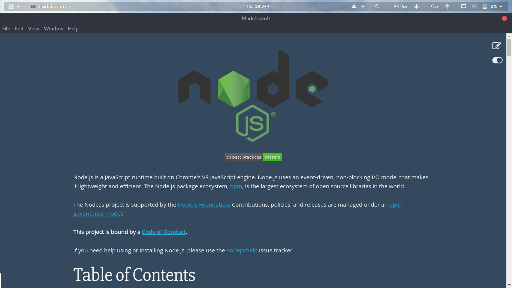
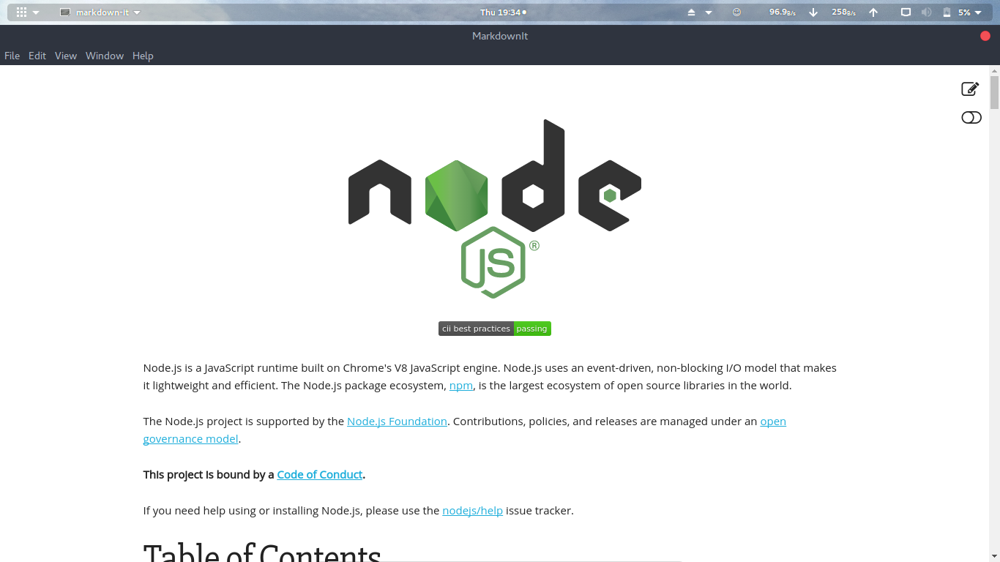

# Markdown-It
This is a desktop app made using electron which will give a preview of an markdown file in your system and the preview of the code.You can change the theme of the app between dark and light with a single toggle button.As of now no edit option is available and the editor will be available soon!!.


# Installation

```sh
$ git clone "url of the repo"
$ sudo npm install
$ sudo npm start
 Markdown-It window will open.
 Open any markdown file you want to preview.
```


You can also:
  - Download the App for linux from this [link]()
  - Download the App for Windows from this [link]()
  - You Can Have Deb file from this [link]()

# Screens
Dark Theme:
---------


Light Theme:
--------

